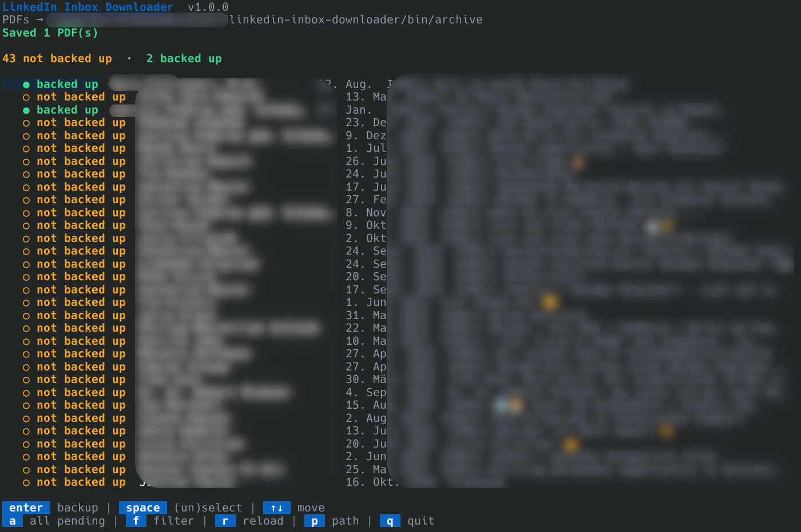
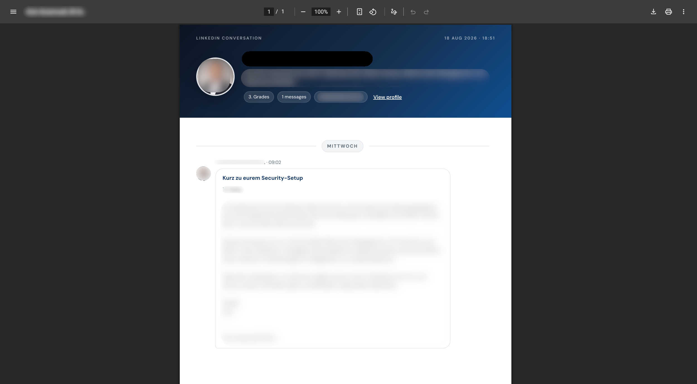

> [!NOTE]
> Helped by AI.

<div align="center">

# LinkedIn Inbox Downloader

**Your best career conversations are trapped in LinkedIn DMs.**

Offers. Intros. Recruiter threads. That founder who said “let’s talk next quarter.”

LinkedIn does not give you an export. **This does.**

[**Download from Releases →**](https://github.com/derkalle4/linkedin-inbox-downloader/releases)

[](https://ko-fi.com/nerdiacs)

This is unpaid side work. If it saved you a thread (or a headache), [buy me a coffee](https://ko-fi.com/nerdiacs) - that’s how this stays alive.



</div>

---

## Why this exists

Your LinkedIn inbox is career IP - not just *messages*. This tool opens Messaging (you log in once in a normal browser window), lists every conversation, and shows what’s already backed up.

- **Your inbox is career IP** - offers, intros, and deal threads deserve a local copy
- **Incremental backups** - **Backed up** means the thread still matches your last PDF; **Not backed up** means never saved, or there’s a **new message** since then
- **Readable PDFs** - clean chat transcripts



---

## Who this is for

- **Job seekers** - keep every recruiter thread and offer conversation offline
- **Recruiters** - archive candidate chats without digging through LinkedIn later
- **Founders & sales** - intros, follow-ups, and “next quarter” threads in one folder
- **Anyone who DMs on LinkedIn** - if the conversation matters, back it up

---

## Tutorial: back up your inbox in 5 minutes

1. **Grab a binary** from [**Releases**](https://github.com/derkalle4/linkedin-inbox-downloader/releases):
   - `linkedin-inbox-downloader-windows-amd64.exe` - Windows
   - `linkedin-inbox-downloader-linux-amd64` - Linux (x86_64)
   - `linkedin-inbox-downloader-linux-arm64` - Linux (ARM64)
2. **Put it in its own folder** - that’s where `archive/`, cookies, and config will live. On Linux: `chmod +x` first.
3. **Run it.** First launch: read the disclaimer and press **y** to accept (or **n** to quit).
4. **Log in once** in the browser window if LinkedIn asks. After login the window closes and this tool takes over.
5. **Pick threads, press Enter.** PDFs land in the `archive/` folder next to the program.
6. **Optional power move:** press **a** to select every thread that is not backed up, then Enter.

**You’re done when** you open `archive/` and see chat PDFs. Run again later - only new or changed threads show as not backed up.

### Files next to the program

| File | Purpose |
|------|---------|
| `config.yaml` | Download folder path, optional image sidecars, and that you accepted the disclaimer |
| `linkedin_cookies.json` | Your LinkedIn session (delete this to log out) |
| `archive/` | Default folder for PDF backups (and `{pdf}_img_01.jpg` sidecars if `download_images` is on) |
| `archive/backup_state.yaml` | current state of all downloaded PDFs |

---

## You need a browser on your computer

This app does **not** ship a browser. It drives one that is already installed:

| System | What you need |
|--------|----------------|
| **Windows** | **Microsoft Edge is enough** - no extra browser to install |
| **Linux** | Google Chrome, Chromium, or Microsoft Edge |

On Windows it prefers Edge first, then Chrome. On Linux it looks for Chrome, then Chromium, then Edge.

The app drives the browser with Chrome’s modern headless mode (`--headless=new`) and a normal headed User-Agent that matches your installed browser version - not the old `HeadlessChrome` string. Backups open each thread by its messaging URL (no re-scrolling the whole inbox) and pause a few seconds between conversations so activity looks more like a person using LinkedIn than a burst of automation.

---

## Set it and forget it

Need a nightly backup without UI? Use `--headless`. It only backs up conversations that are **not currently backed up** (never saved, or a new message since the last PDF). It needs an existing config and cookies - it will **not** open a login window.

1. **Run the interactive UI once** next to where you will install the binary: accept the disclaimer and log in. That creates `config.yaml` and `linkedin_cookies.json`.
2. **Check `config.yaml`** - it should look like [`examples/config.yaml`](examples/config.yaml) (`disclaimer_accepted: true` and a `download_path`). Set `download_images: true` if you also want `{pdf-stem}_img_01.jpg` sidecar files next to each PDF (images stay embedded either way).
3. **Install a crontab** - see [`examples/crontab`](examples/crontab). Put the binary, config, cookies, and log in one folder, then:

   ```bash
   crontab -e
   ```

   Example (runs daily at 03:00, skips if a previous run is still active):

   ```
   PATH=/usr/local/bin:/usr/bin:/bin
   0 3 * * * flock -n /opt/linkedin-inbox-downloader/run.lock /opt/linkedin-inbox-downloader/linkedin-inbox-downloader --headless >> /opt/linkedin-inbox-downloader/headless.log 2>&1
   ```

4. **Check the log** if something fails. Lines look like `2026-08-18 03:00:01 INFO …` or `… ERROR …`. If cookies expired, run the interactive UI once to log in again.

Manual test:

```bash
./linkedin-inbox-downloader --headless
```

---

## Privacy

- Cookies stay **on your machine**, next to the executable.
- The temporary browser profile is deleted when the app exits.
- Delete `linkedin_cookies.json` anytime to forget the session.

---

## Disclaimer

**The author is not responsible for any damages** arising from use of this software.

That includes LinkedIn account restrictions, lost or corrupted data, missed messages, or anything related to LinkedIn’s Terms of Service. Automating LinkedIn may conflict with those terms. **You use this tool entirely at your own risk.**

---

## Keyboard shortcuts

| Key | Action |
|-----|--------|
| `Enter` | Back up selection (or current row) |
| `Space` | Select / deselect |
| `↑` / `↓` or `j` / `k` | Move |
| `a` | Select all not backed up |
| `f` or `/` | Filter |
| `r` | Reload conversation list |
| `p` | Change download path |
| `q` | Quit |

---

<details>
<summary><strong>For developers</strong></summary>

- Bump the `VERSION` file on `main` to cut a release (GitHub Actions builds Windows + Linux binaries and publishes a release with commits since the last tag).
- Local builds (Docker only, no host Go): `make` (help), `make prod`, `make debug`.

</details>

<details>
<summary><strong>Just to make sure...</strong></summary>
This is NOT a serious project. I thought the text above made this clear enough. Anyway, it works (somewhat) and does not steal your credentials :D
</details>

---

License: [GPL-3.0](LICENSE)
